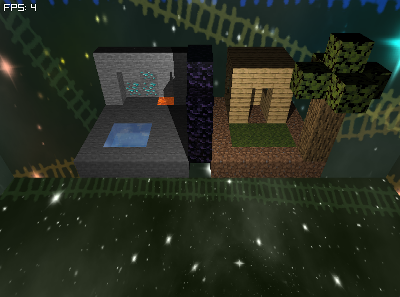

# Raytracer 3D

Un raytracer 3D en tiempo real implementado en Rust usando raylib-rs. Este proyecto incluye renderizado basado en física con soporte para varios materiales, iluminación, reflejos, refracciones y mapeado de texturas.



## Características

- Renderizado en tiempo real con configuración personalizable
- Soporte para múltiples tipos de primitivas (cubos, esferas)
- Materiales basados en física con:
  - Reflexiones difusas y especulares
  - Transparencia y refracción
  - Texturas y mapeado de normales
  - Materiales emisivos (fuentes de luz)
- Iluminación dinámica con sombras
- Skybox con mapeado de entorno
- Controles de cámara para navegar por la escena
- Se incluye el pdf de la planificación de esta escena especifica en el "Planificacion.pdf"

## Requisitos Previos

- Rust (última versión estable)
- Cargo
- Git

## Instalación

1. Clona el repositorio:
   ```bash
   git clone https://github.com/Branuvg/raytracer_graficas.git
   cd raytracer_graficas/raytracer
   ```

2. Construye el proyecto:
   ```bash
   cargo build --release
   ```

## Ejecución del Proyecto

Ejecuta el raytracer con:
```bash
cargo run --release
```

## Controles

### Movimiento de la Cámara
- **W/S**: Mover cámara arriba/abajo
- **A/D**: Acercar/alejar la cámara
- **Flechas**: Orbitar alrededor de la escena
  - **Arriba/Abajo**: Rotar verticalmente
  - **Izquierda/Derecha**: Rotar horizontalmente

## Estructura del Proyecto

```
raytracer_graficas/
├── assets/                 # Texturas e imágenes del skybox
│   ├── skybox/            # Texturas del skybox
│   ├── *.png              # Archivos de textura varios
├── src/
│   ├── main.rs            # Aplicación principal y bucle de renderizado
│   ├── camera.rs          # Implementación de la cámara y controles
│   ├── cube.rs            # Implementación de cubos
│   ├── material.rs        # Propiedades de materiales y sombreado
│   ├── light.rs           # Implementación de fuentes de luz
│   ├── ray_intersect.rs   # Lógica de intersección rayo-objeto
│   ├── snell.rs           # Cálculos de reflexión y refracción
│   └── textures.rs        # Carga y gestión de texturas
└── Cargo.toml            # Configuración del proyecto
```

## Cómo Funciona

El raytracer funciona de la siguiente manera:
1. Para cada píxel en pantalla, lanza un rayo desde la cámara a través de ese píxel
2. Encuentra el objeto más cercano con el que el rayo intersecta
3. Calcula el color en ese punto basándose en:
   - Propiedades del material
   - Iluminación
   - Reflexiones
   - Refracciones
   - Texturas y mapas normales

## Notas de Rendimiento

- El raytracer usa Rayon para procesamiento paralelo de píxeles
- Se recomienda usar el modo release (`--release`) para mejor rendimiento
- Ajusta el parámetro `depth` en `cast_ray` para equilibrar calidad y rendimiento

## Personalización

### Añadir Nuevos Objetos
1. Crea una nueva estructura que implemente el trait `RayIntersect`
2. Añádela a la escena en `main.rs`

### Crear Nuevos Materiales
Modifica la estructura `Material` en `material.rs` para añadir nuevas propiedades

### Cambiar la Escena
Edita la configuración de la escena en `main.rs` para añadir, eliminar o modificar objetos

## Video Demostrativo
[](https://youtu.be/JT5SvBCQtR4)

Haz clic en la imagen para ver el video demostrativo del raytracer en acción.

## Dependencias

- [raylib-rs](https://github.com/deltaphc/raylib-rs) - Bindings de Rust para raylib
- [rayon](https://github.com/rayon-rs/rayon) - Biblioteca de paralelismo de datos